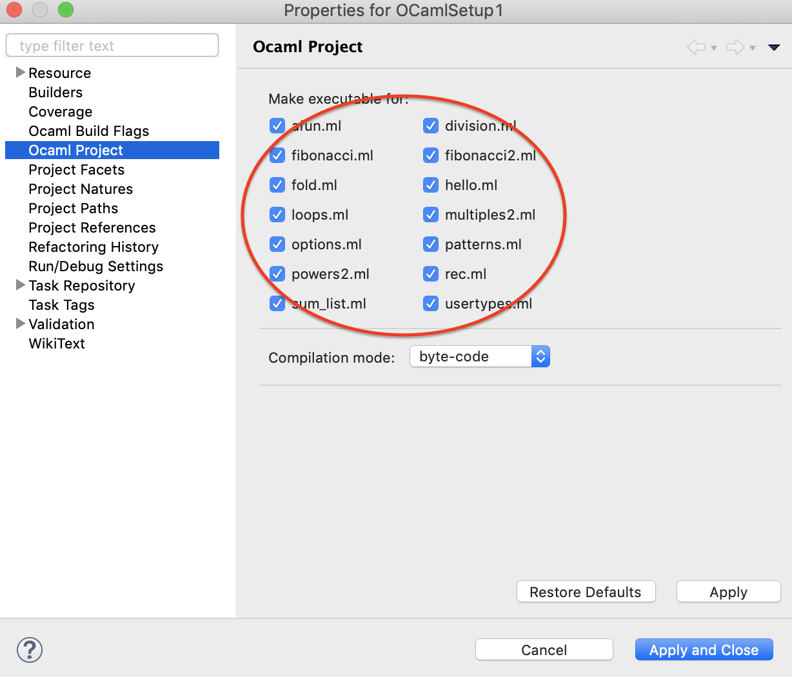

# The OCaml Crash Course
Examples and Assignments

## Installation Instructions (Mac OSX)
1. Install OCaml
    1. Install [Homebrew](https://brew.sh/)
    
        ```/usr/bin/ruby -e "$(curl -fsSL https://raw.githubusercontent.com/Homebrew/install/master/install)"```
        
    2. Install [OCaml](https://ocaml.org/) and Opam
    
        ```
        brew install ocaml
        brew install opam
        ```
    
2. Install Eclipse IDE
    1. Install [Java 1.8+](https://www.oracle.com/technetwork/java/javase/overview/index.html)
    2. Install [Eclipse IDE](https://www.eclipse.org/ide/)

3. Configure Eclipse IDE
    1. Install OcaIDE
        1. Open Eclipse IDE
        2. Goto Help -> Install New Software
            
        3. Type http://www.algo-prog.info/ocaide/ URL, select [OcaIDE](http://www.algo-prog.info/ocaide/) and install it
            
    2. Open OCaml perspective in Eclipse IDE
        
    3. You can configure Eclipse to build OCaml source code automatically:
        1. Goto Project -> Properties
        
        2. Goto Ocaml Project and select the checkboxes to compile, leave *byte-code* compilation mode as is
        
        3. Now you can run OCaml code directly from Eclipse
        

4. Enjoy!
